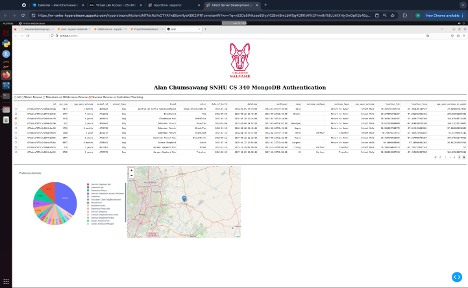

## About the Project
This project implements an interactive dashboard using MongoDB as the backend for the Austin Animal Center Outcomes 
dataset. The project integrates data filtering, dynamic visualizations, and CRUD (Create, Read, Update, Delete) 
operations through a user-friendly interface.

## Motivation
The project was designed to practice real-world database interactions while enhancing visualization skills using Dash.
By combining dynamic data retrieval, geolocation mapping, and user-defined filters, this project showcases an intuitive 
data-driven dashboard.

## Getting Started

1. **Clone the Repository**: Start by cloning this repository to your local machine. This can be done via the command 
line or your preferred Git interface:
   ```sh
   git clone <repository-url>
   ```

2. **Open the Jupyter Notebook**: Navigate to the cloned directory and open the Jupyter Notebook provided. 
3. This notebook serves as an interactive environment where you can create new animals and add them to the shelter database.

3. **Backend Operations**: For those interested in the backend operations, investigate the `AnimalShelter.py` script 
or any other Python scripts included in the project.
The `AnimalShelter` class handles the connection to MongoDB. Ensure your MongoDB server details 
(hostname, port, database name) are correctly configured.

## Installation

- **Python 3**
  ```sh
  sudo apt install python3
  ```

- **MongoDB**
  ```sh
  brew tap mongodb/brew
  brew install mongodb-community
  ```

- **Jupyter Notebook**
  ```sh
  pip install notebook
  ```

## Usage

- **Python Script**: Handles backend functions and connects to MongoDB.

- **Interactive Filters**: This part of the code creates interactive filters using the `dcc.RadioItems` component within
the `app.layout`. This component allows users to select different filter options.

- **Dataset**: Displays the Austin Animal Center dataset. Updates dynamically based on the selected filter. Supports row
selection for detailed data view.

- **Geolocation Map**: Displays the location of selected animal records using `dash_leaflet`. 
Default view centers on the Austin Animal Center.

- **Secondary Chart (Pie Chart)**: Displays the distribution of preferred animal breeds. Updates based on the filtered data.

## Dashboard
Here is a screenshot of the interactive dashboard:



## Contact
Alan Chumsawang
```